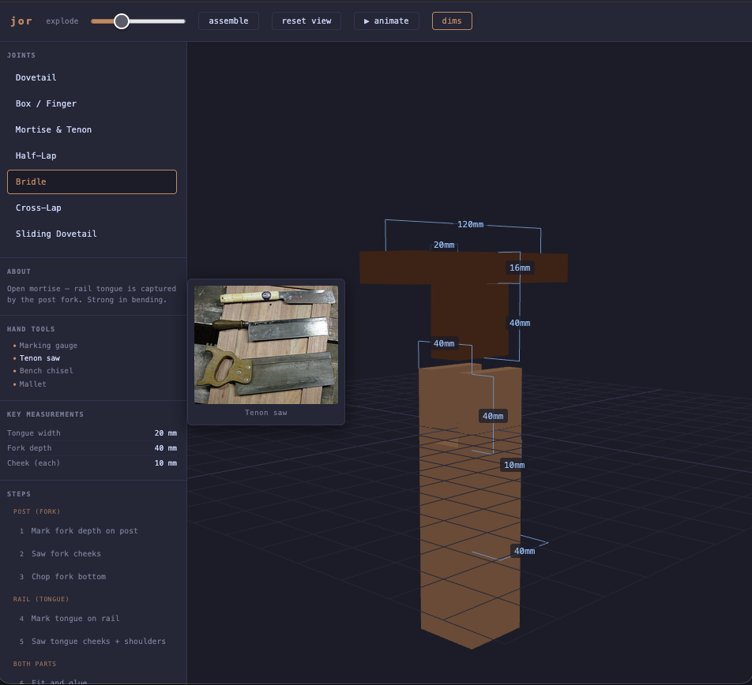

# jor

A ClojureScript single-page app for visualising woodworking joints in 3D. Explore joint geometry, step through cutting sequences, and inspect key measurements — all in the browser.



## Stack

- [shadow-cljs](https://shadow-cljs.github.io/docs/UsersGuide.html) — build tooling
- [Reagent](https://reagent-project.github.io/) + [re-frame](https://day8.github.io/re-frame/) — UI and state
- [Three.js](https://threejs.org/) — 3D rendering

## Joints

- Dovetail
- Box / Finger
- Mortise & Tenon
- Half-Lap
- Bridle
- Cross-Lap
- Sliding Dovetail

## Commands

```bash
# Start dev server with hot-reload (serves on http://localhost:8080)
npx shadow-cljs watch app

# Production build
npx shadow-cljs release app

# Open a browser REPL (after `watch` is running)
npx shadow-cljs cljs-repl app
```
